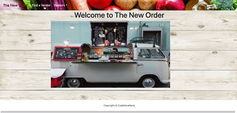
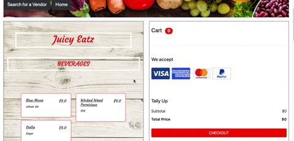

# The New Order

<h1 align="center">
  <br>
  
</h1>

<h4 align="center">A mobile restaurant ordering app</h4>

Presenting the front-end portion of The New Order, a  full-stack interactive web application :computer: that enables mobile food vendors to boost revenue with online ordering and pick-up. It incorporates React.JS, Flux, Python, SQL Alchemy, Agile/Scrum, REST API, Bootstrap, and SCSS to build a convenient and user-friendly application. It includes an active location, menu customization by category, and order organization features :raised_hands: . It is built to enhance food ordering with convenience and also in the midst of health concerns today. It is a developing project with special enhancements coming soon! :rocket:

## Check it out!
👉 https://theneworder-mhxzcx8we.vercel.app/

# Demo
### Login


<br>
### Admin Main Menu (view orders, Add/Edit Menu)


<br>
### Select Vendor on Map (view menu)


<br>
### Select Vendor on Map (view menu and select order)


<br>

## Installation
- Make sure you are using node version 10

1. Install the packages:
```
$ npm install
```
2. Create a .env file:
```
$ cp .env.example .env
```
3. Start coding!

Start the webpack server with live reload:

```
`$ npm run start` for windows, mac, linux or Gitpod.
```


## API
Backend can be found here 👉 https://github.com/NizaV/the-new-order-back-end
<br>
💡 It is deployed on heroku through here 👉 https://the-new-order.herokuapp.com/

### For developers
Clone the source locally:

```sh
$ git clone https://github.com/NizaV/the-new-order-front-end
```

1. Install project dependencies:

```sh
$ npm install
```
2. Create a .env file:
```
$ cp .env.example .env
```
3. Start the app:

```sh
$ npm start
```
💡 Note: Components have been converted into functions to support the use of hooks. There is an example using the Context API inside views/demo.js;

### Your Login
A user has been created for you. Just head to the login page and enter the information below:
- email: demo@gmail.com
- password: demo123

## Features

- [x] Restaruant user signup
- [x] Menu creation
- [x] Map Location
- [x] No singup/login required for ordering
- [ ] Text message notification (soon!)
- [ ] Active Location (soon!)

